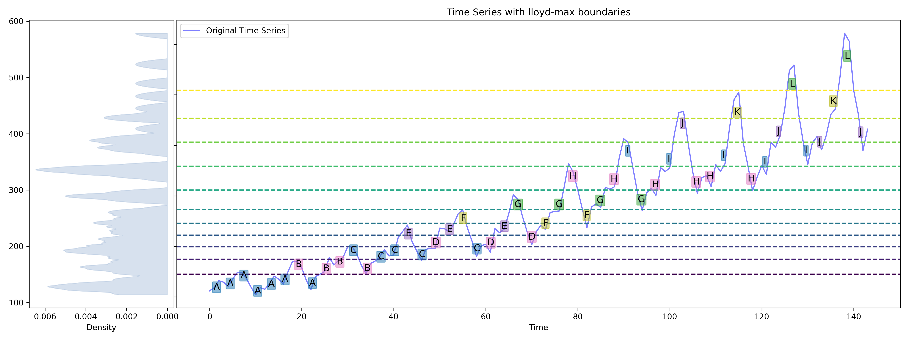

 
 
 
 


[//]: # (![Stars]&#40;https://img.shields.io/github/stars/Dhanunjaya-Elluri/master-thesis?style=social&#41;)


# Master's Thesis

## Transformers for quantized time series forecasting (Work in progress)

The utilization of Transformer models [4], originally designed for natural language processing tasks,
has garnered attention due to their remarkable ability to predict subsequent elements in a sequence.
These models, often referred to as "stochastic parrots," have exhibited a profound mastery of learning
sequential patterns, leading to text generation that closely mimics human-written content. This
remarkable capacity suggests that Transformers might offer a powerful approach to time series forecasting,
leveraging their inherent understanding of sequential dependencies.

In the context of time series forecasting, accurate quantization holds significant potential. By representing continuous data as discrete symbols from a finite alphabet, the complexity of the input domain is reduced, simplifying the forecasting task. This reduction in complexity is particularly appealing for enhancing human interpretability, a crucial factor for the practical application of forecasting methods. Addressing this aspect could bridge the gap between advanced machine learning techniques and human comprehension, facilitating the adoption of cutting-edge forecasting methods in real-world scenarios.

A crucial aspect pertains to the design of time-series-specific positional encodings within the context of quantization. As the focus shifts to a finite alphabet, novel positional encoding strategies could hold the key to capturing the essential temporal dynamics of the data. This exploration aligns with the objective of uncovering more efficient representations that align with the discrete nature of the quantized input domain. Moreover, the proposal aims to conduct a comparative analysis of two prominent quantization methods: Vanilla Symbolic Aggregate Approximation (SAX) [3] and Kernel SAX [1]. While Vanilla SAX assumes a normal distribution of data, Kernel SAX capitalizes on estimating data density for quantization. The flexibility of the Kernel SAX approach raises intriguing questions about its potential to outperform Vanilla SAX in terms of forecasting accuracy. Understanding the practical implications of these quantization methods could provide valuable insights into their applicability in diverse forecasting scenarios.

## Goal of the Thesis

The primary goal of this thesis is to investigate and enhance the effectiveness of time series forecasting through a comprehensive exploration of quantization and transformative modeling techniques.


## Getting Started

To reproduce the experiments and analyses conducted in this thesis, follow these steps:

Clone this repository:
`git clone https://github.com/Dhanunjaya-Elluri/master-thesis.git`

Install the required dependencies in editable mode: 

Run
`pip install -e .`

## Usage
```python
import pandas as pd
from tqts.quantizer.kernel_sax import KernelSAX

# Load the data
df = pd.read_csv("../data/AirPassengers.csv")

kernel_sax = KernelSAX(kernel='epanechnikov', n_alphabet=12, bandwidth=10, epochs=70)
kernel_sax.fit(df['#Passengers'].values, paa_window_size=3, verbose=True)
kernel_sax.plot_with_boundaries(path="../images/")
kernel_sax.save_alphabets("../data/alphabets_with_lloyd.txt")

kernel_sax = KernelSAX(kernel='epanechnikov', n_alphabet=12, bandwidth=10, boundary_estimator='quantile')
kernel_sax.fit(df['#Passengers'].values, paa_window_size=3, verbose=True)
kernel_sax.plot_with_quantiles(path="../images/")
kernel_sax.save_alphabets("../data/alphabets_with_quantiles.txt")
```

## Results
This will save the alphabets and the corresponding boundaries/quantiles in the specified path. The alphabets are saved in the following format:
1. Alphabets obtained from lloyd-max quantizer
```
A A A A A A B A B B C B C C E C D E F C D E G D F G H F G H I G H I J H H I K H I J L I J K L J
```

2. Alphabets obtained from quantile estimation
```
A A B A A B C A B C D B C D E D D E F D D F G E F G H F G H I G H I J H H I K H I J K I J K K J
```

The plots are saved as follows:



## References

[1] Konstantinos Bountrogiannis, George Tzagkarakis, and Panagiotis Tsakalides. “Data-driven Kernelbased
Probabilistic SAX for Time Series Dimensionality Reduction”. In: 2020 28th European Signal
Processing Conference (EUSIPCO). 2021, pp. 2343–2347. DOI: 10.23919/Eusipco47968.2020.9287311.

[2] Rakshitha Godahewa et al. “Monash Time Series Forecasting Archive”. In: Neural Information
Processing Systems Track on Datasets and Benchmarks. 2021.

[3] Jessica Lin et al. “Experiencing SAX: a novel symbolic representation of time series”. In: Data
Mining and Knowledge Discovery 15.2 (2007), pp. 107–144.

[4] Ashish Vaswani et al. “Attention is all you need”. In: Advances in neural information processing
systems. Vol. 30. 2017.

[5] A. Zeng et al. “Are Transformers Effective for Time Series Forecasting?” In: ArXiv preprint
(2022). arXiv: 2205.13504 [cs.LG].

## Contact

If you have any questions, suggestions, or issues regarding this repository or the implemented model, please feel free to contact the author:

Dhanunjaya Elluri <br>
Email: <dhanunjayet@gmail.com> | <dhanunjaya.elluri@tu-dortmund.de>
